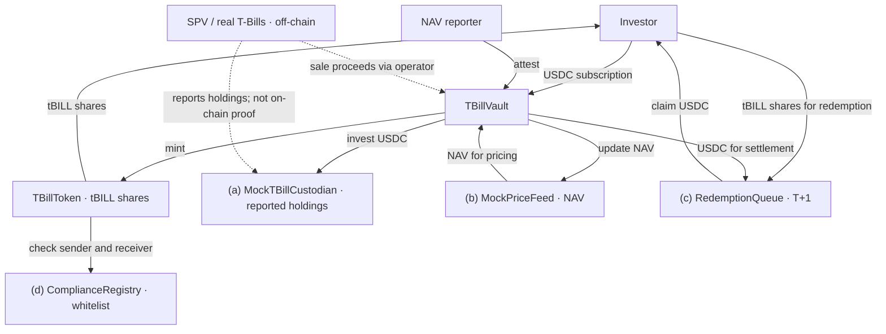

# Lab 2 — How to Tokenize an RWA (Tokenized T-Bills)

In Lab 1 the collateral was **itself a token**. That is why the whole thing could prove itself:
`totalCollateral() == totalSupply()` was a statement the chain could check on its own, and nothing
outside the code had to be trusted.

This lab removes that assumption. The asset is now a **short-dated US Treasury bill**, sitting at a
custodian. What is on-chain is not the asset — it is a **claim on the asset**. The subject of this
lab is the machinery that connects the two:

> **The bridge.** Custody, attestation, physical redemption, and permissioning — the four things
> that have to exist before an off-chain asset can become an on-chain token, and the four places
> where such a token breaks.

Every exercise below is built around a plank of the bridge. If you find yourself only reading NAV
numbers and yields, you have drifted back into Lab 1.

---

## 1. Setup

Pick the track that matches your machine. **Everything after this section is identical for everyone.**

| You are on | Track |
|---|---|
| macOS / Linux | **A** — install Foundry locally |
| Windows | **B** — Codespaces, nothing installed on your machine |

> `lib/` (`forge-std`, `openzeppelin-contracts`) **ships inside this repository**.
> Neither track needs `git clone --recursive`, and neither needs `make setup` —
> a plain clone compiles as-is.

### Track A — macOS / Linux

**Step 1. Install Foundry**

First check whether you already have it:

```bash
forge --version
```

If that prints a version, skip to Step 2. Otherwise install it with the script in this repo (**do not use `foundryup`**):

```bash
bash scripts/install-foundry-cn.sh
```

The script detects your platform, tries GitHub directly, and falls back to the `gh-proxy.com`
mirror. Add the line it prints to `~/.zshrc` or `~/.bashrc`, then reopen your terminal:

```bash
export PATH="$PATH:$HOME/.foundry/bin"
```

> ⚠️ **Why not `foundryup`**: its download goes through GitHub's CDN, which times out reliably from
> mainland China. The mirror does not.

**Step 2. Get the code**

```bash
git clone https://github.com/hgwoops/rwa-lab-2026 && cd rwa-lab-2026
```

Then go to **Verify** below.

### Track B — Windows (Codespaces)

Foundry has **no native Windows binary**, so the straightforward path is to run the lab on
GitHub's servers from your browser. Nothing is installed locally, which also makes it the only
option on locked-down corporate machines.

1. Open <https://github.com/hgwoops/rwa-lab-2026>
2. Green **`Code`** button → **`Codespaces`** tab → **`Create codespace on main`**
3. **The first launch takes 2–5 minutes**: it builds the environment from `.devcontainer/`,
   then automatically runs `make doctor` — you should see a row of `✓` in the terminal
4. In the terminal at the bottom, run:

```bash
make test
```

`7 passed; 0 failed` means you are set.

The free tier is 120 core-hours/month — far more than this lab needs. **Stop it when you are done**
at <https://github.com/codespaces>; a running Codespace keeps burning quota.

### Verify (both tracks)

```bash
make doctor
```

In about 30 seconds this checks the toolchain, the dependencies, and runs the core tests. Anything
marked `✗` comes with the exact command to fix it. All green means you can start; if you cannot fix
it, paste the whole `make doctor` output to the TA.

> New to Foundry? Read **`FOUNDRY-101.md`** before you touch the tests: how a test is shaped, the
> cheatcodes you will need, the command band, and where to look when it breaks.

---

## 2. Quick start

```bash
make doctor        # environment check — all green before you go on
make test          # the checkpoint: core tests, should be all green (7 passed)
make exercise      # the hands-on tasks; red right now — the red ones ARE your task list
make anvil         # terminal A: start a local chain
make deploy-anvil  # terminal B: deploy to it
```

Deployment prints the admin plus seven contracts. Export the ones you need (`$USDC`, `$COMPLIANCE`,
`$FEED`, `$TBILL`, `$CUSTODIAN`, `$VAULT`, `$QUEUE`); the run-it-by-hand commands are in
`EXERCISES.md` Ex1.

**Your task list is `EXERCISES.md`** — every exercise's goal, acceptance command, and where to look.

---

## 3. What the contracts do

The bridge has four planks. Each one is a contract or a role in this repo.

| File | Role | Plank |
|---|---|---|
| `src/MockUSDC.sol` | **Cash.** 6 decimals, with a test faucet. The thing that flows across the bridge | — |
| `src/ComplianceRegistry.sol` | **The guest list.** `setWhitelisted()` / `isWhitelisted()`, gated by `COMPLIANCE_ROLE` | (d) admission |
| `src/TBillToken.sol` | **The claim.** ERC-20, **18 decimals**, mint/burn gated, and every balance change must pass both endpoints' whitelist | (d) admission |
| `src/TBillVault.sol` | **The on-ramp and the books.** `subscribe()` prices shares at the attested NAV; `attest()` is the reporter's only way to move it | (b) attestation |
| `src/exercises/MockTBillCustodian.sol` | **The custodian / SPV.** Answers exactly one question: `realHoldings()` — how much is actually there? | (a) custody |
| `src/exercises/MockPriceFeed.sol` | **The NAV oracle.** 8 decimals; `1.00e8` is par | (b) attestation |
| `src/exercises/RedemptionQueue.sol` | **T+1.** Shares in, a queue ticket out, cash later — **your TODOs, Ex5** | (c) redemption |

### The two invariants you will defend (Ex6)

```
escrow conservation   tBill.balanceOf(queue) == queue.pendingShares()
settlement solvency   usdc.balanceOf(queue) >= queue.totalClaimable()
```

The first says the queue never loses a share and never invents one. The second says it never owes
settled cash it does not hold. Neither is something the chain can verify against the off-chain
asset — that is the point. The three decimal scales (18 + 8 − 6) are in `EXERCISES.md` Ex5; the
third relation that *looks* like an invariant and is not is Ex6.

`script/Deploy.s.sol` wires the whole system together, and the wiring at the bottom **is** part of
the lesson: the vault needs `MINTER_ROLE`; the queue needs `MINTER_ROLE` **and** must be
whitelisted (burning its escrowed shares is a balance change); the vault must be told where the
queue is; the custodian must recognize the vault. Skip any one and the loop reverts.

---

## 4. Homework

**Tier 1 (required)** — the exercises **Ex0–Ex6** in `EXERCISES.md`, and the discussion questions in
`STUDENT-QUESTIONS.md`. Ex1 is a warm-up and is **not graded**. A local Anvil is enough: Tier 1 does
**not** require a testnet. The acceptance command for every exercise is `make exercise` — green when
you are done.

**Tier 2 (bonus)** — deploy to Sepolia and verify the source on Etherscan; put **all seven**
addresses and their Etherscan links in your `README.md`, under a `## Deployment (Sepolia)` heading.
The deploy prints them in this order: `MockUSDC`, `ComplianceRegistry`, `MockPriceFeed`,
`TBillToken`, `MockTBillCustodian`, `TBillVault`, `RedemptionQueue`. The commands are Lab 1's
`README.md` §4, under "Tier 2 (bonus)" — the flow is identical.

**Tier 3 (challenge, optional)** — **Ex7**: `make challenge` (`test/challenges/FalseNav.t.sol`). The
reporter's number is the chain's only window onto the asset; show what happens when it lies, and
name the mechanism that would have caught it.

---

## 5. Common problems

**`Ownable` / role errors**
OpenZeppelin v5 has breaking changes, so v4 tutorials from the web will fail. This repo pins
`v5.0.2` — do not upgrade it.

**`subscribe` reverts with `NotWhitelisted`**
The token is permissioned. Whitelist the recipient first — and remember the **queue** must be
whitelisted too, because burning its escrowed shares counts as a balance change.

**`invest` reverts with `AccessControlUnauthorizedAccount`**
The custodian does not recognize the vault. `script/Deploy.s.sol` grants
`custodian.CUSTODIAN_ROLE()` to the vault — if you wired things by hand, you skipped it.

**Amounts are off by an order of magnitude**
`1000e6 = 1_000_000_000` in smallest units (USDC). Shares are 18 decimals and the NAV is 8 — the
conversion is `shares * nav / 1e20`. Do not compute 18-decimal to 18-decimal.

**Addresses change after restarting Anvil**
Anvil starts from a clean state every time, so you must redeploy.

**`make exercise` hangs, or an invariant failure looks strange**
Foundry replays a cached counterexample from `cache/invariant/` on the next run.
To search for a fresh one, `rm -rf cache/invariant` first.

---

## 6. Submission

Submission follows Lab 1: **one zip of the project** on Moodle, built from the project root.

```bash
rm -f .env        # a private key anywhere in the zip scores zero
zip -r submission.zip . -x '.git/*' 'out/*' 'cache/*' 'broadcast/*' '.env' '.DS_Store'
```

**Keep `lib/` inside it** — those vendored dependencies are what let the grader run `make test`
offline. Drop them and the grader has to fetch from GitHub.

What the zip must contain:

1. The code, with `make exercise` all green (the grader re-runs `make test` themselves)
2. Your answers to the discussion questions in `STUDENT-QUESTIONS.md`
3. An architecture diagram in your `README.md` — a photo of a hand drawing is fine, but it must
   show the **four planks** and where cash and shares cross the bridge

---

## 7. Questions left to you

The discussion prompts live in `STUDENT-QUESTIONS.md` — one per plank, no standard answers, and the
real point of this lab.

## Architecture — the four planks




## Deployment (Sepolia)

Deployed on Ethereum Sepolia (chain ID 11155111).

- MockUSDC: [0xd244B5466119aB7CB405ED9C1163460db0fa074a](https://sepolia.etherscan.io/address/0xd244B5466119aB7CB405ED9C1163460db0fa074a)

- ComplianceRegistry: [0x356BE3B344729A25d6271394B3E6a32B6E1dB98c](https://sepolia.etherscan.io/address/0x356BE3B344729A25d6271394B3E6a32B6E1dB98c)

- MockPriceFeed: [0x65Ec786f35C0115B43746c42F9E6272CB21c8240](https://sepolia.etherscan.io/address/0x65Ec786f35C0115B43746c42F9E6272CB21c8240)

- TBillToken: [0x9fE172E52DE50fb7e679F3Cd414CBc9EBB0d0f0a](https://sepolia.etherscan.io/address/0x9fE172E52DE50fb7e679F3Cd414CBc9EBB0d0f0a)

- MockTBillCustodian: [0x6379E009F03d23EB7C112b37BE3D3091443EF658](https://sepolia.etherscan.io/address/0x6379E009F03d23EB7C112b37BE3D3091443EF658)

- TBillVault: [0xc03269E698A8A912ca177963b82ce1003fa7A46e](https://sepolia.etherscan.io/address/0xc03269E698A8A912ca177963b82ce1003fa7A46e)

- RedemptionQueue: [0x91a34307800Cf71999E4286071af048C21890A37](https://sepolia.etherscan.io/address/0x91a34307800Cf71999E4286071af048C21890A37)